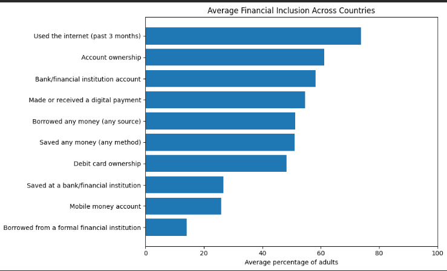
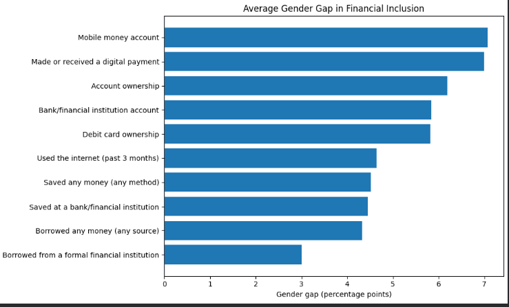
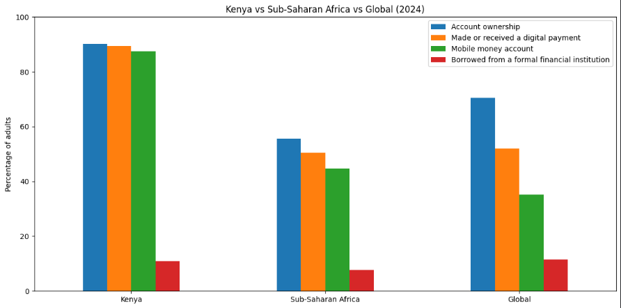

# Financial Inclusion and Gender Analysis

## Project Overview

This project analyses financial inclusion across countries using Global Findex data, with a particular focus on gender differences and Kenya's financial inclusion landscape.

The analysis examines access to and use of financial services, changes over time, gender gaps, and Kenya's position relative to Sub-Saharan Africa and the wider country-level results.

The project was developed as a practical data analytics portfolio project, combining data cleaning, exploratory analysis, statistical testing and data visualisation using Python.

## Research Questions

- What are the main patterns of financial inclusion across countries?
- How does financial inclusion differ between men and women?
- How large are the gender gaps across financial inclusion indicators?
- How has financial inclusion changed over time?
- How does Kenya compare with Sub-Saharan Africa and the wider global picture?
- Are observed differences between men and women statistically significant?

## Key Areas Analysed

The analysis covers ten financial inclusion indicators across four broad areas:

### Access
- Account ownership
- Bank/financial institution account
- Debit card ownership
- Mobile money account

### Usage
- Saved any money
- Saved at a bank/financial institution
- Borrowed any money
- Borrowed from a formal financial institution
- Made or received a digital payment

### Digital Access
- Used the internet in the past three months

## Key Findings

### Global findings

- Financial inclusion varies considerably across the indicators analysed.
- Internet use and account ownership record relatively high average levels across countries.
- Formal borrowing and saving through banks or financial institutions record substantially lower average levels.
- Men record higher financial inclusion values than women on average across the matched observations.
- The overall average gender gap is **5.40 percentage points** in favour of men.
- The gender gap varies considerably across individual financial inclusion indicators.

### Kenya findings

Kenya shows strong levels of financial inclusion in several key areas.

In 2024:

| Indicator | Kenya |
|---|---:|
| Account ownership | 90.18% |
| Made or received a digital payment | 89.34% |
| Mobile money account | 87.56% |
| Borrowed any money | 81.94% |
| Saved any money | 70.23% |
| Internet use | 60.66% |
| Bank/financial institution account | 45.60% |
| Saved at a bank/financial institution | 20.23% |
| Debit card ownership | 19.59% |
| Borrowed from a formal financial institution | 10.97% |

Account ownership in Kenya increased from **42.39% in 2011 to 90.18% in 2024**, an increase of **47.79 percentage points**.

Digital financial services also recorded high levels of adoption. Mobile money account ownership reached **87.56%**, while digital payment use reached **89.34%** in 2024.

Despite overall progress, the analysis indicates that gender disparities remain in account ownership, with men recording higher average values than women across the observed years.

## Visual Highlights

### Global Financial Inclusion


### Gender Gap in Financial Inclusion


### Kenya vs Sub-Saharan Africa vs Global


## Statistical Analysis

A paired t-test was used to compare matched male and female observations.

The test produced:

- Mean gender gap: **5.40 percentage points**
- Median gender gap: **4.46 percentage points**
- t-statistic: **52.78**
- The difference between male and female observations was statistically significant.

The result represents an **unadjusted comparison of matched observations** across countries, years and indicators. It should therefore not be interpreted as evidence that gender alone causes differences in financial inclusion.

## Recommendations

Based on the analysis:

- Strengthen initiatives that address barriers to financial inclusion among women.
- Promote affordable and accessible digital financial services for underserved groups.
- Support financial literacy and awareness initiatives.
- Encourage financial products that respond to the saving and borrowing needs of underserved consumers.
- Continue monitoring gender-disaggregated financial inclusion indicators to identify persistent disparities.

## Tools and Technologies

- **Python**
- **Pandas** — data manipulation and analysis
- **NumPy** — numerical analysis
- **Matplotlib** — data visualisation
- **Seaborn** — visualisation support
- **SciPy** — statistical testing
- **Jupyter Notebook / Google Colab**
- **Microsoft Excel** — source dataset

## Methodology

The analysis followed these main steps:

1. Loaded and inspected the Global Findex dataset.
2. Examined the dataset structure, missing values and duplicate records.
3. Separated country-level observations from regional and income-group aggregates.
4. Validated percentage values and data quality.
5. Calculated descriptive statistics for financial inclusion indicators.
6. Examined gender differences using matched male and female observations.
7. Analysed financial inclusion trends over time.
8. Conducted a focused analysis of Kenya.
9. Compared Kenya with Sub-Saharan Africa and global country-level averages.
10. Applied a paired t-test to assess the statistical significance of observed gender differences.

## Project Structure

```text
financial-inclusion-gender-analysis/
│
├── data/
│   └── GlobalFindexGenderInclusion.xlsx
│
├── Financial_Inclusion_Gender_Analysis.ipynb
│
└── README.md
